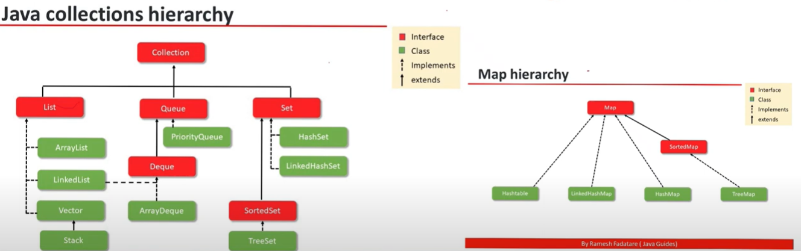
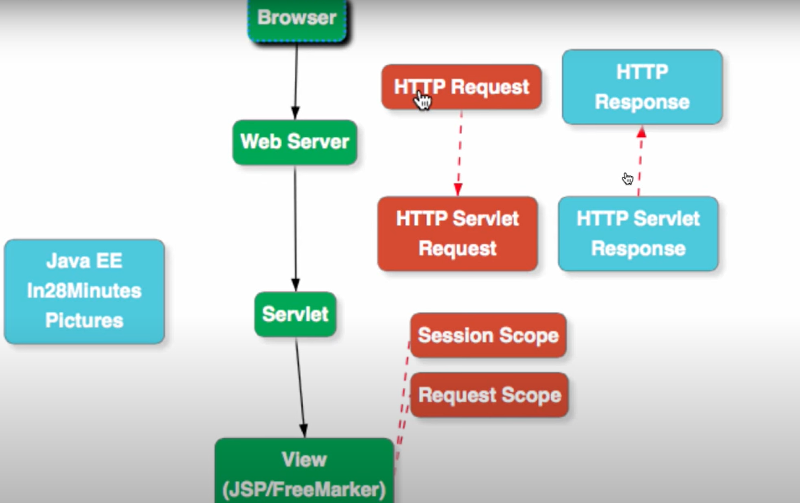

## Doc for understanding the java code
1. WORA---Write once and run Anywhere
2. Buld in support for multiThreading
3. High Performance - JIT Compiler
4. JVM---> The engine that executes java bytecode
    * This allows the java code tobe platform independent.
5. Writing and compiling the simple java code using **JDK**.
6. Running the java apllication using the **JRE**
7. Understanding how **JVM** executes the bytecode.
8. Performance improvment using the **JIT** compiler.

## When and where to apply:


## API
1. Collection API ----> Used with Array to search,add,update,remove,search,rearrange.
2. Streams API ---> they effectively filter ,map and reduce large stream of datas.
                     They achieve this using the lambdaexpressions.
                     Lambda are part of the functional programming.
3. IO API ----> path, FIles
4. Concurrency API ---> 
5. Java Persistence API ---> JDBC enables database Connectivity, JPA for relational mapping.


## Implement Web services with Java

## Enterprise Java Edition

## Object Orientented Concepts
1. who gave the ideaology to create the concept and they should tal to each other :


## Naming Conventions

1. pascal naming convention : Classes ---> class is a container to have the methods
2. Camel naming convention : methods()
3. Package ---> com.package (This package is the company name we sahll add)

## Java Editions

1. Standard Edition -
2. Enetrprise Edition - Very large scale and distributed and fault tolerent devices
3. Micro Edition - Smart cards and Android
4. Java card - Latest one developed in 2019

## Fundamentals of the java

1. **methods**: 
@override if it happens in the run time means dynamic binding
@overide happens in the compile time it is ----> static binding 
* methods with the final keyword can not be overriden.

## Polymorphism


## Various types in the java

1. Primitive Types
    * will store small data
    * Eg: byte(127 to -127),short,int(int view=123_124_345),long,float,double,char(international letters),boolean
    * In total there are 8 Primitive objects there.
    * stored in the stack memory.

    ```Java
    //* signed left shift (<<)
        public class SignedLeftShiftExample {
    public static void main(String[] args) {
        int x = 0x02; // 2 in decimal
        System.out.println("Original: " + Integer.toHexString(x)); // 2
        x = x << 1; // Left shift by 1
        System.out.println("After Signed Left Shift: " + Integer.toHexString(x)); // 4
            }
        }

        //concept
        Before Shift: 0000 0010
        After Shift: 0000 0100 (This is 4 in decimal, which is 0x04 in hexadecimal)

        //output
            Original: 2
            After Signed Left Shift: 4


    //* unsigned left shift (<<<)

        public class SignedLeftShiftNegativeExample {
             public static void main(String[] args) {
        int x = 0xFFFFFFFE; // -2 in decimal
        System.out.println("Original: " + Integer.toHexString(x)); // fffffffe
        x = x << 1; // Left shift by 1
                    System.out.println("After Signed Left Shift: " + Integer.toHexString(x)); // fffffffc
                }
            }

            //concept
                Before Shift: 1111 1111 1111 1111 1111 1111 1111 1110
                After Shift: 1111 1111 1111 1111 1111 1111 1111 1100 (This is -4 in decimal

            //output
            Original: fffffffe
            After Signed Left Shift: fffffffc


2. Reference types(what ever object you are creating comes under the reference type)
    * This reference helps to make more complex structures in the java.
    * Example:
        1. Array : int[] numbers=[1,2,3];

        2. String: String name="john";
        3. ([]) ---> Entry point of the Aray varaible
        4. sorting --->Arrays.sort(numbers)
        5. searching ----> Arrays.binarySearch(numbers,30)//searches for 30 in the array
        6. Copying ---> System.arraycopy() and Arrays.copyOf()
        7. .equals() method important to remember in the Array concept
        8. Important 
            ```Java
            	int arr1[] = {1, 2, 3}; 
                int arr2[] = {1, 2, 3}; 
                if (arr1.equals(arr2)) ===> Here arr1 and arr2 not same , arr1.equals(arr2) checks for reference equality and will return false unless arr1 and arr2 point to the same object. 

                * But using Arrays.equals(arr1,arr2) it is same since 
                ----> This uses the Arrays.equals static method, which performs an element-by-element comparison for equality.

                Class: class myClass{int x;}
    * This is stored in the Heap memory.
    * Can be null
    * Are created by the **programmers** and not defined by **Java(except string)**

    ```Java
    public class ReferenceTypeExample {
    public static void main(String[] args) {
        // Creating a String object using the new keyword
        String greeting = new String("Hello, world!");

        // Using the length() method (a reference method) on the String object
        int length = greeting.length();

        System.out.println("Length of the greeting: " + length);
    }
    ```

## Packages in the java

1. awt ---> This is for the GUI and handling graphics and the images.
2.

# Java DataType

## String

1. String in immutable

```Java
public class ImmutableStringExample {
    public static void main(String[] args) {
        String original = "Sachin"; // Creates a string in the pool

        // Modify the string (creates a new string)
        String modified = original.concat(" Tendulkar");

        System.out.println("Original: " + original); // Prints "Sachin"
        System.out.println("Modified: " + modified); // Prints "Sachin Tendulkar"
    }
}
```

## Special characters

1. Back slash (\)

2. ```Java
    public class Main {
    public static void main(String[] args) {
    System.out.println("Hello world\njin");
        System.out.println("Hello world\tjin");
        System.out.println("Hello world\\jin");
        System.out.println("Hello world\"njin\"");

        }
    }
    //output
    Hello world
    jin
    Hello world jin
    Hello world\jin
    Hello world"njin"

## Arrays (util package)

1. sort is one of the method of array

2. ```Java
    public class Main {
    public static void main(String[] args) {
    //Arrays

        int[] numbers= new int[5];
        numbers[0]=0;
        numbers[1]=1;
        System.out.println(numbers);
        System.out.println(Arrays.toString(numbers));

        int[] numbers2= {1,2,3,4,5};
        System.out.println(numbers2);
        System.out.println(Arrays.toString(numbers2));

        }
    }
    //output
    [I@65ab7765
    [0, 1, 0, 0, 0]
    [I@1b28cdfa
    [1, 2, 3, 4, 5]

3. 2D Array

    ```Java
    public class Main {
    public static void main(String[] args) {
    //2dArrays
      int[][] twoDarray=new int[2][3];
      twoDarray[0][0]=2;
        System.out.println(Arrays.toString(twoDarray));
        System.out.println(Arrays.deepToString(twoDarray));

        int[][] twoDarrayobj={{1,2,3},{4,5,6}};
        System.out.println(twoDarrayobj);
        System.out.println(Arrays.toString(twoDarrayobj));
        System.out.println(Arrays.deepToString(twoDarrayobj));

        }
    }
    //output
    [[I@65ab7765, [I@1b28cdfa]
    [[2, 0, 0], [0, 0, 0]]
    [[I@7229724f
    [[I@4c873330, [I@119d7047]
    [[1, 2, 3], [4, 5, 6]]


## Arrays Methods


## Assignment operator & final keyword

1. Icremental understanding

    ```Java

    public class Main {
    public static void main(String[] args) {

      final int u=9;
      int x=1;
      int y=++x;
      int z=x++;
      int r=x++;

      //Augmented assigned operator
       x += 3;

      System.out.println(x);
      System.out.println(y);
      System.out.println(z);
      System.out.println(r);


        }
    }
    //output
    7
    2
    2
    3

## Casting

1. casting explicit(auto casting)

    ```java
    public class Main {
    public static void main(String[] args) {

      //Explicit casting
      // byte > short > int > long > float > double
      int x=1;
      //casting done over here
      short y= (short) (x+1);
      System.out.println(y);

      String name="Ajin";
      int value=2;
      String output=name+value;
      System.out.println(output);

      String number="34";
      // parse with different values added over here
      // Example: parseInt(),parseFloat(),parseDouble()
      int newValue=Integer.parseInt(number);
      long newNumber=value+newValue;
      System.out.println(newNumber);


        }
    }
    //output
    2
    Ajin2
    36

## Maths

1. Mehtods in the Math class
    * ceil,floor,round,random,max,min

    * ```Java
        int ceilUnderstanding= (int) Math.ceil(1.3F);
        int floorUnderstanding=(int) Math.floor(1.3F);
        Math.round(floorUnderstanding);
            System.out.println(ceilUnderstanding);
            System.out.println(floorUnderstanding);
            System.out.println(Math.round(floorUnderstanding));
            System.out.println((int)(Math.random()*100));
            System.out.println(Math.random()*100);
        //output
        2
        1
        1
        10
        69.70801530638205

## Number formmating(Abstract type NUmberFormat used over )

1. Here the NumberFormat is an abstract type so no need to cerate an object for the same.
2. Currency conversion and percentage conversion it is used for

    ```Java
    //NumberFormat is an abstract so instead of creating an new object 
      // we shall use the factory methods
      // like getCurrency which will create the object and do the required for us.
     NumberFormat currency= NumberFormat.getCurrencyInstance();
     String currencyValue=currency.format(12324);
      System.out.println(currencyValue);

      // for getting the percentage using the getPercentInstance()
      String percentage=NumberFormat.getPercentInstance().format(12344);
      System.out.println(percentage);

      //output     
        ₹12,324.00
        1,234,400%

## Scanner class

1. ```Java
    public static void main(String[] args) {
      Scanner scan=new Scanner(System.in);
      // trim() added to ensure that the front and after white spaces are removed
      String name=scan.nextLine().trim();
      System.out.println("Enter the Age:");
      int age=scan.nextInt();
      System.out.println("The entered name is : "+ name);
      System.out.println("The entered age is : "+ age);
        }
    //output
      Ajin Roch   
    Enter the Age:
    40
    The entered name is : Ajin Roch
    The entered age is : 40

## Mortage Calculator

1. Example problem

    ```Java
     //calculator problem
      Scanner cmdinput=new Scanner(System.in);
      System.out.println("Principal :");
      int principal=cmdinput.nextInt();

      System.out.println("Annual interest  rate");
      float floatInput=cmdinput.nextFloat();
      float monthlyInterestRate = floatInput / (100*12) ;


      System.out.println("Period (Years) :");
      short shortInput=cmdinput.nextShort();
      short noOfPayments= (short) (shortInput*12);


      double mortage=principal*((monthlyInterestRate*Math.pow(1+monthlyInterestRate,noOfPayments))/
              (Math.pow(1+monthlyInterestRate,noOfPayments)-1));

      String mortageCurrency=NumberFormat.getCurrencyInstance().format(mortage);
      System.out.println(mortageCurrency);

## Switch statement

## While loop

1. While loop is used with .equals since the hash memory also we need to consider.
2. while is used when the user do not have idea how many inputs the user will get
3. Infinite while loop : **while(true){}**

    ```Java
    public class Main {
    public static void main(String[] args) {

      Scanner scan=new Scanner(System.in);
      String input="";
      while(!input.equals("quit")){
        input=scan.next().toLowerCase();
        System.out.println(input);
      }


        }
    }

## FOR EACH LOOP

1. Enhanced for loop can not be reversed directly
    Example:
2.  syntax: forEach(datatype variable:array_name)
3: **Infinite for loop---> for(;;){}**

    ```java
          public static void main(String[] args) {

      String[] fruits ={"Orange","Apple","fig"};

      for(int i=0;i<fruits.length;i++){
        System.out.println(fruits[i]);
      }

      //Enhanced for loop
      // Enhanced for loop disadvantage is this can not be reversed
      for(String fruit:fruits){
        System.out.println(fruit);
      }


        }
    //output
    Orange
    Apple
    fig
    Orange
    Apple
    fig

# Junit Testing

1. some key points
    * Combination of Junit [(Junit platform)]
        [1] Junit Jupiter ---> which provide the API to write the test
        [2] Junit Vintage ---> which provides the backward compactability for the same.
        [3] 3rd party testing frameworks---> where other APIs shall be added.
2. Junit-5
    * @Test tag will be used.
    * Your return will be void
    * To create Object for the method that we are goint to test we sahll use the var with new object.
    * Methods in the the Junit
        1. assertEquals();
        2. assertNotEqauls();
        3. assertNull();
        4. assertNotnull();

    * Example:

    ```java
    char gradeChecker(int value) {

    if(value <0 ) {
    throw new IllegalArgumentException();
    }
    
    else if (value < 80) {
    return 'B';
    }
    
    else if(value >= 90) {
    return 'A';
    }
    
    else if(value < 70) {
    return 'C';
    }
    
    else {
    return 'k';
    }
  
     }

    //Testing code
    @Test
 
    void illegalValues() {
  
     assertThrows(IllegalArgumentException.class, ()->{grade.gradeChecker(-1);});
  
  
    }
 
    @Test
     void aGrade() {
     assertEquals('A', grade.gradeChecker(90));
    }

# Collections in Java

1. **what is the use of ArrayList and others** :
    Collections in Java provide a standardized way to manage groups of objects. The Collection framework includes several interfaces (e.g., List, Set, Map) and their implementations (e.g., ArrayList, HashSet, HashMap).

    ```Java
        import java.util.ArrayList;
        import java.util.HashMap;

        public class CollectionExample {
            public static void main(String[] args) {
                // ArrayList Example
                ArrayList<String> fruits = new ArrayList<>();
                fruits.add("Apple");
                fruits.add("Banana");
                fruits.add("Mango");

                // Iterating ArrayList
                for (String fruit : fruits) {
                    System.out.println(fruit);
                }

                // HashMap Example
                HashMap<Integer, String> students = new HashMap<>();
                students.put(1, "Alice");
                students.put(2, "Bob");
                students.put(3, "Charlie");

                // Iterating HashMap
                for (Integer id : students.keySet()) {
                    System.out.println("ID: " + id + ", Name: " + students.get(id));
                }
            }
        }

        // Best Practices:
            Use Generics: Always use generics to ensure type safety.
            Prefer interfaces: Use interfaces (List, Map) as references rather than concrete classes (ArrayList, HashMap).
            Choose the right collection: Use ArrayList for dynamic arrays, HashSet for unique elements, and HashMap for key-value pairs.
2. **Serialization**
    Serialization in Java is a mechanism to convert an object into a byte stream, allowing it to be easily stored or transmitted. Deserialization is the reverse process.

    ```java
    import java.io.*;

        class Employee implements Serializable {
            private static final long serialVersionUID = 1L; // Best practice
            String name;
            int id;

            public Employee(String name, int id) {
                this.name = name;
                this.id = id;
            }
        }

        public class SerializationExample {
            public static void main(String[] args) {
                Employee emp = new Employee("John Doe", 101);

                // Serialization
                try (ObjectOutputStream oos = new ObjectOutputStream(new FileOutputStream("employee.ser"))) {
                    oos.writeObject(emp);
                    System.out.println("Employee serialized");
                } catch (IOException e) {
                    e.printStackTrace();
                }

                // Deserialization
                try (ObjectInputStream ois = new ObjectInputStream(new FileInputStream("employee.ser"))) {
                    Employee deserializedEmp = (Employee) ois.readObject();
                    System.out.println("Employee deserialized: " + deserializedEmp.name + ", ID: " + deserializedEmp.id);
                } catch (IOException | ClassNotFoundException e) {
                    e.printStackTrace();
                }
            }
        }


       // Best Practices:
        Use serialVersionUID: Always define serialVersionUID for better control over the serialization version.
        Handle transient fields: Mark sensitive fields as transient to avoid serialization.
        Use try-with-resources: This ensures that streams are closed automatically.

3. **Threading**
    Explanation:
    Threading in Java allows concurrent execution of tasks. The Thread class and Runnable interface are the foundations of multithreading in Java.

    ```Java
            class MyRunnable implements Runnable {
            @Override
            public void run() {
                System.out.println(Thread.currentThread().getName() + " is running");
            }
        }

        public class ThreadExample {
            public static void main(String[] args) {
                Thread thread1 = new Thread(new MyRunnable(), "Thread-1");
                Thread thread2 = new Thread(new MyRunnable(), "Thread-2");

                thread1.start();  // Starts the thread
                thread2.start();
            }
        }

    //Best Practices:
        Prefer Runnable over Thread: Implement Runnable instead of extending Thread for better flexibility.
        Avoid creating too many threads: Use thread pools (ExecutorService) for better resource management.
        Always name your threads: This makes debugging easier.

4. **Concurrency**
    Concurrency involves multiple threads running simultaneously, which can lead to race conditions. Java provides concurrency utilities like synchronized, volatile, and classes in the java.util.concurrent package to manage this.

    ```Java
    class Counter {
    private int count = 0;

    public synchronized void increment() {
        count++;
    }

    public int getCount() {
        return count;
    }
        }

        public class ConcurrencyExample {
            public static void main(String[] args) {
                Counter counter = new Counter();

                Runnable task = () -> {
                    for (int i = 0; i < 1000; i++) {
                        counter.increment();
                    }
                };

                Thread thread1 = new Thread(task);
                Thread thread2 = new Thread(task);

                thread1.start();
                thread2.start();

                try {
                    thread1.join();
                    thread2.join();
                } catch (InterruptedException e) {
                    e.printStackTrace();
                }

                System.out.println("Final count: " + counter.getCount());
            }
        }

        //Best Practices:
        Use synchronized blocks: Synchronize critical sections of code to prevent race conditions.
        Use volatile for visibility: Mark shared variables as volatile to ensure visibility across threads.
        Use java.util.concurrent utilities: Prefer classes like ReentrantLock, CountDownLatch, and ConcurrentHashMap for advanced scenarios.

5. **Exceptions**
    Explanation:
    Exceptions in Java represent errors that occur during program execution. Java has checked exceptions (subclasses of Exception) and unchecked exceptions (subclasses of RuntimeException).

    ```Java
    public class ExceptionExample {
    public static void main(String[] args) {
        try {
            int result = divide(10, 0);
            System.out.println("Result: " + result);
        } catch (ArithmeticException e) {
            System.out.println("Error: " + e.getMessage());
        }
    }

    public static int divide(int a, int b) {
        if (b == 0) {
            throw new ArithmeticException("Division by zero is not allowed");
        }
        return a / b;
    }
        }
    //Best Practices:
    Use specific exceptions: Always catch specific exceptions rather than a generic Exception.
    Provide meaningful messages: Exception messages should clearly describe the problem.
    Handle exceptions gracefully: Ensure that your program can recover or terminate safely.

6. **Add on**

    Difference Between HashMap, Set, and List
List:

Definition: A List is an ordered collection (sequence) that allows duplicates and provides indexed access to elements.
Key Characteristics:
Maintains the order of insertion.
Allows duplicate elements.
Provides access by index.
Common Implementations: ArrayList, LinkedList.
Set:

Definition: A Set is a collection that does not allow duplicate elements.
Key Characteristics:
Does not allow duplicates.
No guarantee of iteration order (in the case of HashSet).
Common Implementations: HashSet, LinkedHashSet, TreeSet.
HashMap:

Definition: A HashMap is a collection of key-value pairs, where each key is unique.
Key Characteristics:
Keys are unique; values can be duplicate.
No guarantee of iteration order.
Allows fast retrieval, insertion, and deletion of key-value pairs.
Common Implementations: HashMap, LinkedHashMap, TreeMap.
When to Use Each Collection Type:

1. ArrayList:
When to Use:
Use ArrayList when you need fast random access to elements.
It's a good choice if the number of elements is not expected to change frequently, or if you have more reads than writes.
Example:
java
Copy code
ArrayList<String> names = new ArrayList<>();
names.add("Alice");
names.add("Bob");
System.out.println(names.get(1)); // Output: Bob
Best for: Frequent read operations, random access to elements.
2. LinkedList:
When to Use:
Use LinkedList when you need fast insertion and deletion at the beginning or middle of the list.
It's suitable when the size of the list is frequently changing.
Example:
java
Copy code
LinkedList<String> tasks = new LinkedList<>();
tasks.add("Task 1");
tasks.addFirst("Task 0"); // Insert at the beginning
System.out.println(tasks.get(0)); // Output: Task 0
Best for: Frequent insertions/deletions, sequential access.
3. HashMap:
When to Use:
Use HashMap when you need to associate keys with values and you need fast access based on keys.
It's ideal when you have large datasets and you need to retrieve data based on unique keys.
Example:
java
Copy code
HashMap<Integer, String> employeeMap = new HashMap<>();
employeeMap.put(101, "John");
employeeMap.put(102, "Jane");
System.out.println(employeeMap.get(101)); // Output: John
Best for: Fast key-based lookups, storing key-value pairs.
4. HashSet:
When to Use:
Use HashSet when you need to store unique elements and you don't care about the order.
It's ideal for filtering duplicates or creating collections of unique elements.
Example:
java
Copy code
HashSet<String> uniqueNames = new HashSet<>();
uniqueNames.add("Alice");
uniqueNames.add("Bob");
uniqueNames.add("Alice"); // Duplicate, will not be added
System.out.println(uniqueNames.size()); // Output: 2
Best for: Storing unique elements, fast lookups for existence.
Detailed Explanation of When and Why to Use Specific Implementations:
ArrayList vs. LinkedList:
ArrayList:

Provides fast random access (i.e., get() method) because it's backed by a dynamic array.
However, inserting or deleting elements from anywhere other than the end of the list is slower due to the need to shift elements.
Use Case: When you need to store and access large numbers of elements in a fixed sequence, e.g., storing and accessing records where insertions and deletions are infrequent.
LinkedList:

Provides better performance for insertions and deletions in the middle or beginning of the list because it uses a doubly-linked list internally.
Accessing an element by index is slower as it requires traversal from the start of the list.
Use Case: When you need frequent insertion and deletion operations, e.g., implementing a queue or deque where elements are frequently added and removed from both ends.
HashMap vs. TreeMap:
HashMap:

Allows fast access and modification because it uses a hash table internally.
No ordering of the elements.
Use Case: When you need a simple, fast key-value store without any need for order, e.g., storing user data by unique IDs.
TreeMap:

Maintains keys in a sorted order (natural ordering or by a custom comparator).
Slower than HashMap due to the sorting overhead.
Use Case: When you need the keys to be in a specific order, e.g., creating a leaderboard where you need to display users sorted by score.
HashSet vs. LinkedHashSet:
HashSet:

Provides constant time performance for basic operations like add, remove, and contains.
Does not maintain any order of elements.
Use Case: When you just need to ensure that there are no duplicate elements and don't care about the order, e.g., storing unique tags for a blog post.
LinkedHashSet:

Maintains the order of insertion while still ensuring uniqueness.
Slightly slower than HashSet due to the ordering overhead.
Use Case: When you need to maintain insertion order, e.g., storing unique elements but needing them in the order they were added, like maintaining a unique ordered history of user actions.
Summary:
Use ArrayList when you need fast random access and don't need to frequently add/remove elements in the middle of the list.
Use LinkedList when you frequently add/remove elements at both ends or in the middle and don't need fast random access.
Use HashMap for key-value pairs with fast lookup, insertion, and deletion without needing to maintain order.
Use HashSet for a collection of unique elements where order doesn't matter.
Use LinkedHashSet when you need a collection of unique elements but want to maintain insertion order.
By understanding the characteristics of each collection and their use cases, you can choose the most appropriate data structure for your specific needs.

7. Resource with waiting time will be used in the Queue
8. Basic Ideas about the Collections:
    * Interfaces used basics is iterable,
    
    *

# JAVA EE UPDATE

1. How does the flow looks:
    

2. Designing a web application using the JAVA EE Applications:

    1. create a project using the maven build:
    2. Add the required dependencies like javax and javax.servlet in the **pom.xml** file
    **Hints**
        *Javax == Java Extension pack*
        *Interfaces == ServletResponse & servletResponse*
        *Abstract == Abstract class that simplifies writing the Http servlets*
        *Other classes == filters,lifecycle,listeners and the session managements*

        ```XML
        <dependencies>
        <!-- javaee web api -->
        <dependency>
        <groupId>javax</groupId>
        <artifactId>javaee-web-api</artifactId>
        <version>6.0</version>
        <scope>provided</scope>
        </dependency>

        <!--jstl -->
        <dependency>
        <groupId>javax.servlet</groupId>
        <artifactId>jstl</artifactId>
        <version>1.2</version>
        </dependency>
            </dependencies>

    3. create **web.xml** which is the deployment descriptor.
        It is an XML file that provides essential configuration information to the servlet container (such as Tomcat, Jetty, or WildFly) during deployment

        ```XML (web.xml)

        <web-app xmlns="http://java.sun.com/xml/ns/javaee"
         xmlns:xsi="http://www.w3.org/2001/XMLSchema-instance"
         xsi:schemaLocation="http://java.sun.com/xml/ns/javaee http://java.sun.com/xml/ns/javaee/web-app_3_0.xsd"
         version="3.0">

            <display-name>Todolist MVC</display-name>

            <session-config>
                <session-timeout>30</session-timeout>
            </session-config>

            <welcome-file-list>
                <welcome-file>index.do</welcome-file>
            </welcome-file-list>

            </web-app>

    4. view is done with the jsp

        ```jsp
        ${error}
        <form method="post" action="/login">
            <input type="email" name="email" placeholder="your email" value="${requestScope.email}"/>
            <input type="password" name="password" placeholder="your password" value="${requestScope.password}"/>
            <input type="submit" value="submit"/>
        </form> 

        SUCCESS - ${email} : ${password}

    5. main java file using the servlet:

        ```java
                package com.in28minutes.servletjsp.web.servlet.example;

        import java.io.IOException;

        import javax.servlet.ServletException;
        import javax.servlet.annotation.WebServlet;
        import javax.servlet.http.HttpServlet;
        import javax.servlet.http.HttpServletRequest;
        import javax.servlet.http.HttpServletResponse;

        @WebServlet(urlPatterns = "/login")
        public class LoginServlet extends HttpServlet {
            @Override
            protected void doGet(HttpServletRequest request,
                    HttpServletResponse response) throws ServletException, IOException {
                request.getRequestDispatcher("/WEB-INF/views/login.jsp").forward(
                        request, response);
            }

            @Override
            protected void doPost(HttpServletRequest request,
                    HttpServletResponse response) throws ServletException, IOException {
                // user@google.com, password
                String email = request.getParameter("email");
                String password = request.getParameter("password");

                request.setAttribute("email", email);
                request.setAttribute("password", password);

                if (email.equalsIgnoreCase("user@google.com")
                        && password.equalsIgnoreCase("password")) {
                    request.getRequestDispatcher("/first").forward(request, response);
                } else {
                    request.setAttribute("error", "Invalid ID/Password");
                    request.getRequestDispatcher("/WEB-INF/views/login.jsp").forward(
                            request, response);
                }
            }
        }

    6. filter file

        ```java

                package com.in28minutes.servletjsp.web.servlet.filter;

        import java.io.IOException;
        import java.util.Enumeration;

        import javax.servlet.Filter;
        import javax.servlet.FilterChain;
        import javax.servlet.FilterConfig;
        import javax.servlet.ServletException;
        import javax.servlet.ServletRequest;
        import javax.servlet.ServletResponse;
        import javax.servlet.annotation.WebFilter;
        import javax.servlet.http.HttpServletRequest;

        @WebFilter(urlPatterns = { "/*" })
        public class RequestLoggingFilter implements Filter {

            @Override
            public void destroy() {
            }

            @Override
            public void doFilter(ServletRequest request, ServletResponse response,
                    FilterChain chain) throws IOException, ServletException {

                HttpServletRequest req = (HttpServletRequest) request;
                Enumeration<String> headerNames = req.getHeaderNames();

                while (headerNames.hasMoreElements()) {
                    String headerName = headerNames.nextElement();
                    System.out.print(headerName);
                    String headerValue = req.getHeader(headerName);
                    System.out.println(":" + headerValue);
                }

                chain.doFilter(request, response);
            }

            @Override
            public void init(FilterConfig arg0) throws ServletException {
            }

        }

## Java EE Servlet Details:

* @WebInitparam:
                Used to specify initialization parameters for a servlet.
        These parameters can be accessed within the servlet using the getInitParameter() method
* @WebFilter: -> Filters can modify request/response data or perform other tasks.
* @webListener: -> Used to declare a listener class that responds to application lifecycle events (e.g., context initialization, session creation, etc.).
* @ServletSecurity

* @Stateless
        Stateless Objects:
    A stateless object refers to an instance of a class that does not contain any modifiable data within itself.
    Stateless objects lack an internal state, and their behavior is solely determined by the input parameters provided to their methods.
    These objects are particularly useful for algorithms or utility methods that don’t need to maintain any persistent state.
## major required things in the Enterprise edition
* Model class ---> (JPA connectivity)
* Service layer ---> EJB work on Book related logic
* Exception handling ---> using the utils class
* JSP --> view
* JMS ---> Java mailing service for achieving asunchrinization
* Persistence.xml ---> for JPA configuration
* web.xml ---> Deployment descriptor for servlet connectivity

## Problems to work on before interview


